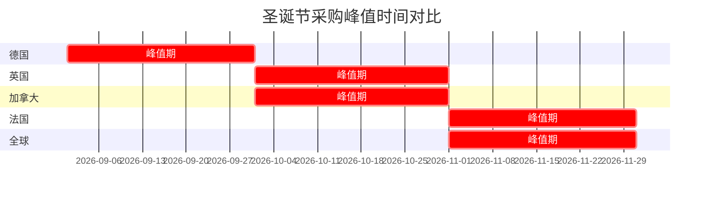

# Fominte 2026 年内容营销日历

> 基于 Faire 2025 年全球搜索数据的工厂端营销布局 | 最后更新：2026-01-09

---

## 一、核心洞察：Faire 批发采购数据揭示的规律

> [!IMPORTANT] > **关键发现**：批发需求比销售时刻**早数月开始**，而**最激烈的竞争发生在加速期，而非峰值期**。

### 采购周期三阶段模型

```
开始月份 (Start)    →    加速期 (Acceleration)    →    峰值月份 (Peak)
     ↓                        ↓                           ↓
  需求开始上升            搜索量增速最快               采购活动最高
  (选择最广)             (核心订单期)               (补单而非首单)
```

**Fominte 策略原则**：

- ✅ 在**开始月份**发布内容，吸引早期调研者
- ✅ 在**加速期之前**加大投放，避开竞争最激烈期
- ✅ 在**峰值期**提供快速交期产品，服务补单需求

### 全球节假日采购周期 (基于 Faire 搜索数据)

| 节日       | 开始月份 | 加速期     | 峰值月份 | 搜索量      | **Fominte 营销窗口** |
| ---------- | -------- | ---------- | -------- | ----------- | -------------------- |
| **情人节** | 10 月    | 11 月-1 月 | 1 月     | 88K         | **9 月-12 月**       |
| **复活节** | 12 月    | 1 月-3 月  | 3 月     | 72K         | **11 月-2 月**       |
| **春季**   | 11 月    | 12 月-2 月 | 2 月     | 61K         | **10 月-1 月**       |
| **母亲节** | 1 月     | 2 月-4 月  | 4 月     | 43K         | **12 月-3 月**       |
| **夏季**   | 1 月     | 2 月-5 月  | 5 月     | 84K         | **12 月-4 月**       |
| **秋季**   | 5 月     | 6 月-8 月  | 8 月     | 130K        | **4 月-7 月**        |
| **万圣节** | 5 月     | 7 月-9 月  | 9 月     | 88K         | **4 月-8 月**        |
| **圣诞节** | 5 月     | 8 月-11 月 | 11 月    | **294K** ⭐ | **4 月-10 月**       |

> [!TIP] > **最大机会**：圣诞节搜索量是其他节日的 3-5 倍，必须重点布局。超过 55%的圣诞采购集中在 10-11 月。

---

## 二、各国市场采购差异 (Faire 数据)

> [!IMPORTANT] > **市场差异显著**：不同国家的采购峰值时间差异可达 2 个月，需针对性布局。

### �� 英国市场 - 峰值更早，竞争更激烈

| 节日       | 采购开始 | 峰值                        | 搜索量 |
| ---------- | -------- | --------------------------- | ------ |
| **圣诞节** | 6 月     | **10 月** (比全球早 1 个月) | 24K    |

**特点**：

- 需求从 6 月开始，**9-10 月是最激烈的采购月**
- 等到 11 月已经错过核心采购窗口

**Fominte 策略**：

- ✅ 针对英国客户，圣诞内容最晚在**5 月**上线
- ✅ **8-9 月**集中投放 Google Ads (UK)
- ✅ EDM 在**9 月初**触达英国客户

---

### �� 法国市场 - 需求渐进，窗口更长

| 节日            | 采购开始 | 峰值  | 搜索量 |
| --------------- | -------- | ----- | ------ |
| **Noël (圣诞)** | 6 月     | 11 月 | 5K     |

**特点**：

- 需求更**渐进**，不会急剧飙升
- 采购窗口更长，给零售商更多灵活性

**Fominte 策略**：

- ✅ 可比英国稍晚布局，但仍需在**10 月前**完成主要内容
- ✅ 法语内容或法语 SEO 优化可考虑

---

### �� 德国市场 - 窗口最短，决策最早

| 节日                   | 采购开始 | 峰值             | 搜索量 |
| ---------------------- | -------- | ---------------- | ------ |
| **Weihnachten (圣诞)** | 5 月     | **9 月** (最早!) | 5K     |

**特点**：

- 德国零售商**提前决策**，采购窗口最短
- **9 月峰值**意味着 8 月已是核心订单期

**Fominte 策略**：

- ✅ 针对德国客户需要**最早**触达
- ✅ 圣诞内容在**4 月**准备，**7-8 月**重点投放
- ✅ 德语内容/德语着陆页有较强竞争优势

---

### 🇨🇦 加拿大市场 - 类似美国，窗口集中

| 节日       | 采购开始 | 峰值      | 搜索量 |
| ---------- | -------- | --------- | ------ |
| **情人节** | 11 月    | 1 月      | 2.5K   |
| **夏季**   | 12 月    | 6 月      | 2.5K   |
| **万圣节** | 6 月     | 9 月      | 0.5K   |
| **圣诞节** | 6 月     | **10 月** | 10K    |

**特点**：

- 需求集中在 1-2 个峰值月，**短窗口决策**
- 节日季采购在**10 月峰值**，比美国略早

**Fominte 策略**：

- ✅ 可与美国市场策略合并
- ✅ 注意加拿大 Thankgiving(10 月)与美国(11 月)不同

---

### 📊 各国圣诞采购峰值对比



### 市场优先级建议

| 优先级 | 市场        | 圣诞峰值 | 策略要点                 |
| ------ | ----------- | -------- | ------------------------ |
| 1      | � 全球/美国 | 11 月    | 标准节奏，最大市场       |
| 2      | 🇬🇧 英国     | 10 月    | 提前 1 个月，需单独规划  |
| 3      | �� 德国     | 9 月     | 需最早触达，考虑德语内容 |
| 4      | 🇨🇦 加拿大   | 10 月    | 可与美国合并             |
| 5      | �� 法国     | 11 月    | 窗口更宽，灵活度高       |

---

## 三、产品线 × 节日采购周期匹配

> 结合 Faire 搜索数据与 Fominte 产品特性

### 产品 × 节日匹配矩阵

| Fominte 产品                    | 匹配节日/季节            | 采购开始    | 加速期                 | 峰值       | **内容上线时间**   |
| ------------------------------- | ------------------------ | ----------- | ---------------------- | ---------- | ------------------ |
| **网布绣花面料** (婚纱/晚礼服)  | 春季婚礼季 + 母亲节      | 11 月/1 月  | 12 月-2 月 / 2 月-4 月 | 2 月/4 月  | **10 月-1 月**     |
| **钩针绣花面料** (礼服/时装)    | 春季 + 复活节            | 11 月/12 月 | 12 月-2 月 / 1 月-3 月 | 2 月/3 月  | **10 月-2 月**     |
| **时尚绣花面料** (亮片/3D/珠绣) | **圣诞节 + 新年派对** ⭐ | 5 月        | 8 月-11 月             | 11 月      | **4 月-10 月**     |
| **仿手钩成衣** (Boho/度假风)    | 夏季                     | 1 月        | 2 月-5 月              | 5 月       | **12 月-4 月**     |
| **仿皮草成衣**                  | 秋季 + 圣诞              | 5 月        | 6 月-8 月 / 8 月-11 月 | 8 月/11 月 | **4 月-10 月**     |
| **摇粒绒成衣**                  | 秋季 + 万圣节            | 5 月        | 6 月-8 月 / 7 月-9 月  | 8 月/9 月  | **4 月-8 月**      |
| **定制礼服 (OEM)**              | 全年（圣诞最旺）         | 持续        | 8 月-11 月             | 11 月      | **持续 + Q3 加强** |

### 年度营销重点可视化

```
       Q1              Q2              Q3              Q4
 1月  2月  3月    4月  5月  6月    7月  8月  9月    10月  11月  12月
 ├────┼────┼────┼────┼────┼────┼────┼────┼────┼────┼────┼────┤

 婚纱面料 ████████████░░░░░░░░░░░░░░░░░░░░░░░░░░░░░░░░░░░░░
 春季+复活节 ██████████████████░░░░░░░░░░░░░░░░░░░░░░░░░░░░
 钩针成衣 ████████████████░░░░░░░░░░░░░░░░░░░░░░░░░░░░░░░░
 夏季面料 ░░░░████████████████████░░░░░░░░░░░░░░░░░░░░░░░░
 秋季+万圣节 ░░░░░░░░░░░░░░░░████████████████████░░░░░░░░░░
 皮草/摇粒绒 ░░░░░░░░░░░░░░░░████████████████████░░░░░░░░░░
 ★圣诞节★ ░░░░░░░░░░░░░░░░░░░░████████████████████████████

 ████ = Fominte 营销窗口    ░░░░ = 非重点期
```

> [!IMPORTANT] > **年度最大机会：圣诞节**
>
> - 搜索量 294K (是其他节日的 3-5 倍)
> - 匹配产品：时尚绣花面料(亮片/3D)、仿皮草成衣、定制礼服
> - 营销窗口：4 月-10 月（比你想象的早很多！）

---

## 四、2026 年逐月内容日历

> [!TIP] > **阅读指南**：每月标注了对应的 Faire 采购周期阶段和重点产品线

---

### Q1: 1-3 月 | 情人节加速期 + 春季/复活节启动

#### 🗓️ 1 月 (当前) ⭐ 情人节加速期高峰

**Faire 数据**：情人节搜索峰值月 (占全年 85%+的采购集中在 12 月-2 月)

| 采购周期           | 对应产品                          |
| ------------------ | --------------------------------- |
| 情人节：**峰值月** | 红色/粉色蕾丝面料、浪漫系礼服面料 |
| 复活节：加速期开始 | 春季色系钩针绣花面料              |
| 春季：加速期       | 婚纱网布绣花面料、时装面料        |
| 母亲节：开始月     | 典雅风格面料                      |

| 类型 | 内容主题                                                       | 产品线        | 目标关键词                                  | 优先级 |
| ---- | -------------------------------------------------------------- | ------------- | ------------------------------------------- | ------ |
| Blog | "Valentine's Day Fabric Guide: Red Lace & Romantic Embroidery" | 网布/钩针面料 | red lace fabric wholesale, valentine fabric | ⭐⭐⭐ |
| Blog | "2026 Spring Wedding Dress Fabric Trends"                      | 网布绣花      | wedding dress fabric trends 2026            | ⭐⭐⭐ |
| Blog | "Easter Collection Fabric Ideas for Boutiques"                 | 钩针绣花      | Easter fabric wholesale, spring lace        | ⭐⭐   |
| pSEO | 补充情人节/春季婚纱场景页                                      | 全产品        | mesh embroidery for bridal wholesale        | ⭐⭐   |
| EDM  | Valentine's Day Last Call (针对延迟采购商)                     | -             | -                                           | ⭐⭐⭐ |
| 社媒 | 红色/粉色面料展示 + 婚纱面料预览                               | -             | -                                           | ⭐⭐   |

**各国市场差异化行动**：

- 🌍 全球/美国：情人节内容最后冲刺
- 🇬🇧 英国：同步推送，在线 B2B 活跃

**行动要点**：

- [ ] 首页 Banner 更新为情人节 + 春季主题
- [ ] 发布 2-3 篇 Blog 文章
- [ ] 针对 Atlanta Winter Market (1/13-19) 发送 EDM

---

#### 🗓️ 2 月 | 春季峰值 + 复活节/母亲节加速

**Faire 数据**：春季搜索峰值月 | 复活节&母亲节正在加速

| 采购周期           | 对应产品               |
| ------------------ | ---------------------- |
| 春季：**峰值月**   | 钩针绣花面料、时装绣花 |
| 复活节：加速期     | 轻盈春季面料           |
| 母亲节：加速期开始 | 优雅风格面料、礼服面料 |
| 夏季：加速期开始   | Boho 钩针成衣          |

| 类型 | 内容主题                                                   | 产品线        | 目标关键词                                       | 优先级 |
| ---- | ---------------------------------------------------------- | ------------- | ------------------------------------------------ | ------ |
| Blog | "Spring 2026 Fashion Embroidery: Top Trends for Retailers" | 时尚绣花      | spring fashion embroidery, fashion fabric trends | ⭐⭐⭐ |
| Blog | "Mother's Day Collection: Elegant Lace Fabric Ideas"       | 网布/钩针面料 | mother's day fabric, elegant lace wholesale      | ⭐⭐⭐ |
| Blog | "Crochet Clothing Wholesale: 2026 Buying Guide"            | 仿手钩成衣    | crochet clothing wholesale, boho dress supplier  | ⭐⭐⭐ |
| pSEO | 补充母亲节/夏季度假场景页                                  | 成衣          | crochet beach dress wholesale                    | ⭐⭐   |
| EDM  | 春季面料目录 + 母亲节提前采购提醒                          | -             | -                                                | ⭐⭐⭐ |
| 社媒 | 展示春季面料工艺、钩针成衣新品                             | -             | -                                                | ⭐⭐   |

**行动要点**：

- [ ] 确保婚纱/春季面料页面 SEO 优化到位
- [ ] 补充仿手钩成衣 pSEO 页面

---

#### 🗓️ 3 月 | 复活节峰值 + 夏季加速

**Faire 数据**：复活节搜索峰值月 | 夏季持续加速

| 采购周期           | 对应产品             |
| ------------------ | -------------------- |
| 复活节：**峰值月** | 春季礼服面料         |
| 夏季：加速期       | 仿手钩成衣、轻薄面料 |
| 母亲节：加速期     | 礼服面料             |

| 类型 | 内容主题                                                   | 产品线     | 目标关键词                                           | 优先级 |
| ---- | ---------------------------------------------------------- | ---------- | ---------------------------------------------------- | ------ |
| Blog | "Summer Fabric Sourcing Guide for Retailers"               | 轻薄面料   | summer fabric wholesale, lightweight fabric supplier | ⭐⭐⭐ |
| Blog | "Beach Vacation Clothing Wholesale: Crochet & Boho Styles" | 仿手钩成衣 | beach crochet dress wholesale, vacation clothing     | ⭐⭐⭐ |
| Blog | "Easter Lace Fabric: Last Minute Sourcing Tips"            | 钩针绣花   | Easter lace fabric, spring dress fabric              | ⭐⭐   |
| pSEO | 大量补充夏季度假场景页                                     | 成衣       | boho crochet swimsuit cover wholesale                | ⭐⭐⭐ |
| 社媒 | 展示夏季轻薄面料工艺、沙滩装展示                           | -          | -                                                    | ⭐⭐   |

**行动要点**：

- [ ] 夏季产品页面全面上线
- [ ] 仿手钩成衣成为重点推广产品

---

### Q2: 4-6 月 | 母亲节峰值 + 夏季峰值 + **秋季/圣诞开始** ⚡

> [!WARNING] > **关键转折点**：从 5 月开始，秋季(130K)和圣诞(294K)的采购需求开始启动！这是全年最大商机的起点。

#### 🗓️ 4 月 | 母亲节加速 + 夏季加速 + 地球日

**Faire 数据**：母亲节加速期 | 夏季持续加速

| 采购周期                        | 对应产品           |
| ------------------------------- | ------------------ |
| 母亲节：加速期                  | 典雅蕾丝、定制礼服 |
| 夏季：加速期                    | 仿手钩成衣、度假装 |
| 情人节/复活节/春季：✅ 已过峰值 | -                  |

| 类型 | 内容主题                                                           | 产品线     | 目标关键词                                             | 优先级 |
| ---- | ------------------------------------------------------------------ | ---------- | ------------------------------------------------------ | ------ |
| Blog | "Mother's Day Last Minute Sourcing: Elegant Dress Fabrics"         | 网布绣花   | mother's day dress fabric, elegant lace wholesale      | ⭐⭐⭐ |
| Blog | "Sustainable Lace Fabric: Eco-Friendly Wholesale Options" (地球日) | 全产品     | sustainable lace fabric, eco-friendly fabric wholesale | ⭐⭐⭐ |
| Blog | "Summer Vacation Clothing: Crochet & Boho Wholesale Guide"         | 仿手钩成衣 | summer crochet clothing, vacation dress wholesale      | ⭐⭐   |
| pSEO | 继续补充夏季场景页                                                 | 成衣       | beach wedding dress wholesale                          | ⭐⭐   |
| 社媒 | 地球日主题：展示环保工艺                                           | -          | -                                                      | ⭐⭐   |

**行动要点**：

- [ ] 如有环保认证，突出展示
- [ ] 创建 /sustainable-fabric 专题页
- [ ] 开始准备秋季/圣诞内容素材

---

#### 🗓️ 5 月 ⭐⭐ 年度关键月 | 夏季峰值 + 秋季/万圣节/圣诞开始

**Faire 数据**：夏季搜索峰值月 | **秋季、万圣节、圣诞采购正式开始！**

> [!IMPORTANT] > **战略转折点**：从这个月开始，您需要**同时**准备两条线：
>
> 1. 夏季产品：最后冲刺（峰值月）
> 2. 秋冬/节日产品：内容开始上线（开始月）

| 采购周期           | 对应产品                   |
| ------------------ | -------------------------- |
| 夏季：**峰值月**   | 仿手钩成衣、轻薄面料       |
| 秋季：**开始月**   | 仿皮草成衣、摇粒绒         |
| 万圣节：**开始月** | 主题面料                   |
| 圣诞：**开始月**   | 亮片/3D 绣花、仿皮草、礼服 |

| 类型 | 内容主题                                                       | 产品线        | 目标关键词                                     | 优先级 |
| ---- | -------------------------------------------------------------- | ------------- | ---------------------------------------------- | ------ |
| Blog | "Fall/Winter 2026 Fabric Preview: What Retailers Should Stock" | 时尚绣花/皮草 | fall winter fabric trends, faux fur wholesale  | ⭐⭐⭐ |
| Blog | "Faux Fur Coat Wholesale: Early Bird Advantage"                | 仿皮草成衣    | faux fur coat wholesale, faux fur manufacturer | ⭐⭐⭐ |
| Blog | "Holiday Season Fabric: Order Now for Q4 Success"              | 亮片绣花      | christmas fabric wholesale, holiday embroidery | ⭐⭐⭐ |
| Blog | "Summer Crochet Clothing: Final Buying Window"                 | 仿手钩成衣    | summer crochet wholesale, vacation clothing    | ⭐⭐   |
| pSEO | 大量生成秋季/圣诞场景页                                        | 皮草/绣花     | sequin fabric for holiday dress                | ⭐⭐⭐ |
| EDM  | 秋冬产品早鸟预览 + 夏季最后机会                                | -             | -                                              | ⭐⭐⭐ |

**各国市场差异化行动**：

- 🇩🇪 德国：圣诞采购开始，需要触达德国客户
- 🌍 全球：秋季/圣诞内容上线

**行动要点**：

- [ ] 仿皮草、摇粒绒产品页面优化
- [ ] 亮片/3D 绣花面料作为圣诞主推产品
- [ ] 生成秋季/圣诞 pSEO 页面 100+

---

#### 🗓️ 6 月 | 秋季加速开始 + 圣诞逐步升温 + 英国提前布局

**Faire 数据**：秋季加速期开始 | 圣诞持续攀升

| 采购周期         | 对应产品                   |
| ---------------- | -------------------------- |
| 秋季：加速期开始 | 仿皮草成衣、摇粒绒         |
| 万圣节：加速期前 | 主题色面料                 |
| 圣诞：持续上升   | 亮片/3D 绣花、派对礼服面料 |

| 类型 | 内容主题                                           | 产品线     | 目标关键词                                             | 优先级 |
| ---- | -------------------------------------------------- | ---------- | ------------------------------------------------------ | ------ |
| Blog | "Sequin & 3D Embroidery Fabric for Party Season"   | 时尚绣花   | sequin embroidery fabric wholesale, party dress fabric | ⭐⭐⭐ |
| Blog | "Fleece Jacket Wholesale: Complete Sourcing Guide" | 摇粒绒成衣 | fleece jacket wholesale, polar fleece manufacturer     | ⭐⭐⭐ |
| Blog | "Halloween Fabric Ideas for Retailers"             | 全产品     | halloween fabric wholesale, costume fabric             | ⭐⭐   |
| pSEO | 持续生成节日场景页                                 | 绣花/成衣  | faux fur vest wholesale, christmas party dress         | ⭐⭐⭐ |
| EDM  | Atlanta Market 夏季展配合 + 节日产品推广           | -          | -                                                      | ⭐⭐⭐ |
| 社媒 | 节日面料展示、工厂生产能力                         | -          | -                                                      | ⭐⭐⭐ |

**各国市场差异化行动**：

- 🇬🇧 英国：圣诞节采购开始，6 月需开始触达
- 🇩🇪 德国：已进入采购期，需加大投放

**行动要点**：

- [ ] 针对 Atlanta Market 夏季展 (6/9-14) 发送 EDM + 社媒推广
- [ ] Google Ads 开始增加节日相关关键词

---

### Q3: 7-9 月 ⭐⭐⭐ 年度最关键营销期

> [!CAUTION] > **年度决战期**：秋季(130K)峰值 + 万圣节(88K)峰值 + 圣诞(294K)加速期全部集中在这 3 个月！
>
> **营销预算建议**：全年预算的 **40-50%** 应投入 Q3

#### 🗓️ 7 月 | 万圣节加速 + 秋季加速 + 圣诞持续升温

**Faire 数据**：万圣节搜索暴增 3 倍(6 月 4,462 → 7 月 14,684) | 秋季/圣诞持续加速

| 采购周期               | 对应产品                     |
| ---------------------- | ---------------------------- |
| 万圣节：**加速期高速** | 主题色面料、派对装           |
| 秋季：加速期           | 仿皮草成衣、摇粒绒成衣       |
| 圣诞：加速期开始       | 亮片/3D 绣花、红金绿色系面料 |

| 类型 | 内容主题                                                | 产品线     | 目标关键词                                                | 优先级 |
| ---- | ------------------------------------------------------- | ---------- | --------------------------------------------------------- | ------ |
| Blog | "Christmas Collection Fabric: Red, Gold & Green Trends" | 时尚绣花   | Christmas dress fabric, holiday lace fabric               | ⭐⭐⭐ |
| Blog | "Faux Fur Jacket Wholesale: Complete Sourcing Guide"    | 仿皮草成衣 | faux fur jacket manufacturer, wholesale faux fur supplier | ⭐⭐⭐ |
| Blog | "Halloween & Fall Party Fabric: Wholesale Guide"        | 全产品     | halloween party dress fabric, fall colors wholesale       | ⭐⭐⭐ |
| pSEO | 持续生成圣诞/万圣节场景页                               | 绣花/成衣  | red sequin fabric Christmas, faux fur holiday outfit      | ⭐⭐⭐ |
| EDM  | 节日季产品目录（面料+成衣）                             | -          | -                                                         | ⭐⭐⭐ |
| 广告 | **加大 Google Ads 投放** (节日关键词)                   | -          | -                                                         | ⭐⭐⭐ |

**各国市场差异化行动**：

- 🇩🇪 德国：**8 月已是核心订单期！** 7 月需全力冲刺德国客户
- 🇬🇧 英国：加速期进行中，持续推送
- 🌍 全球：节日季内容全面覆盖

**行动要点**：

- [ ] **本月为年度营销投入最高期**
- [ ] 首页突出节日主题产品（亮片绣花、仿皮草）
- [ ] 准备好快速交期产品清单
- [ ] Google Ads 预算翻倍

---

#### 🗓️ 8 月 ⭐⭐⭐ 秋季峰值 + 圣诞核心加速期

**Faire 数据**：秋季(130K)搜索峰值月 | 圣诞持续高速加速

> [!WARNING] > **德国圣诞峰值在即**：9 月是德国圣诞采购峰值，8 月是德国客户的最后决策窗口！

| 采购周期             | 对应产品                   |
| -------------------- | -------------------------- |
| 秋季：**峰值月**     | 仿皮草成衣、摇粒绒成衣     |
| 圣诞：**加速期高峰** | 亮片/3D 绣花、派对礼服面料 |
| 万圣节：加速期       | 主题面料                   |

| 类型 | 内容主题                                                | 产品线     | 目标关键词                                             | 优先级 |
| ---- | ------------------------------------------------------- | ---------- | ------------------------------------------------------ | ------ |
| Blog | "Last Chance: In-Stock Fabrics for Holiday Rush"        | 全产品     | quick ship embroidery fabric, in stock lace wholesale  | ⭐⭐⭐ |
| Blog | "Fast Lead Time Clothing Manufacturer in China"         | OEM 服务   | fast lead time clothing manufacturer, quick turnaround | ⭐⭐⭐ |
| Blog | "New Year's Eve Party Dress Fabric: Sequin & Sparkle"   | 亮片绣花   | new year dress fabric, sparkle embroidery wholesale    | ⭐⭐⭐ |
| Blog | "Faux Fur Coat: Last Ordering Window for Fall Delivery" | 仿皮草成衣 | faux fur coat last minute, fall fur wholesale          | ⭐⭐   |
| EDM  | 紧急提醒：节日季最后下单窗口                            | -          | -                                                      | ⭐⭐⭐ |
| 社媒 | 展示生产能力和交期优势、工厂实拍                        | -          | -                                                      | ⭐⭐⭐ |
| 广告 | **维持高投放** + 增加"quick ship"关键词                 | -          | -                                                      | ⭐⭐⭐ |

**各国市场差异化行动**：

- 🇩🇪 德国：**圣诞峰值在即，最后冲刺！**
- 🇬🇧 英国：持续加速，为 10 月峰值准备
- 🇨🇦 加拿大：圣诞采购活跃

**行动要点**：

- [ ] 突出 "Ready to Ship" / "Quick Lead Time" 信息
- [ ] 针对德国市场专门发送 EDM
- [ ] 更新产品页交期信息

---

#### 🗓️ 9 月 | 万圣节峰值 + 德国圣诞峰值 + 英国/加拿大圣诞加速

**Faire 数据**：万圣节(88K)峰值月 | 德国圣诞峰值 | 英国/加拿大圣诞加速

> [!IMPORTANT] > **德国圣诞峰值月**：德国客户此月做出最终采购决策
> **万圣节峰值月**：最后补单机会

| 采购周期              | 对应产品           |
| --------------------- | ------------------ |
| 万圣节：**峰值月**    | 主题色面料、派对装 |
| 圣诞 🇩🇪：**德国峰值** | 亮片绣花、仿皮草   |
| 圣诞 🇬🇧🇨🇦：加速期高峰 | 同上               |
| 圣诞 🌍：加速期       | 同上               |

| 类型 | 内容主题                                     | 产品线   | 目标关键词                                        | 优先级 |
| ---- | -------------------------------------------- | -------- | ------------------------------------------------- | ------ |
| Blog | "Winter Wedding Dress Fabric Ideas"          | 网布绣花 | winter wedding dress fabric, winter bridal lace   | ⭐⭐   |
| Blog | "2027 Spring Fashion Preview: Fabric Trends" | 时尚绣花 | 2027 fashion trends fabric, spring fabric preview | ⭐⭐   |
| Blog | "Halloween Costume Fabric: Rush Order Tips"  | 全产品   | halloween costume fabric, last minute halloween   | ⭐⭐   |
| EDM  | 节日季补单提醒 + 2027 春季早鸟预览           | -        | -                                                 | ⭐⭐⭐ |
| 广告 | 开始降低节日词投放，增加春季词               | -        | -                                                 | ⭐⭐   |

**各国市场差异化行动**：

- 🇩🇪 德国：**圣诞峰值月，全力服务已有询盘**
- 🇬🇧 英国：**10 月峰值在即，持续推送**
- 🇨🇦 加拿大：同英国

**行动要点**：

- [ ] 开始规划 2027 年春季内容
- [ ] 为英国/加拿大 10 月峰值准备最后一波内容

---

### Q4: 10-12 月 | 圣诞峰值收尾 + 2027 年布局

#### 🗓️ 10 月 | 英国/加拿大圣诞峰值 + 情人节/春季开始

**Faire 数据**：英国(24K)/加拿大(10K)圣诞峰值月 | 情人节采购开始

> [!IMPORTANT] > **双线运营**：
>
> 1. 圣诞：英国/加拿大峰值，全球接近峰值，最后一波推送
> 2. 来年：情人节/春季采购开始，需启动新一轮内容

| 采购周期              | 对应产品                  |
| --------------------- | ------------------------- |
| 圣诞 🇬🇧🇨🇦：**峰值月** | 亮片绣花、仿皮草、礼服    |
| 圣诞 🌍：接近峰值     | 同上                      |
| 情人节：**开始月**    | 红色/粉色蕾丝、浪漫系面料 |

| 类型 | 内容主题                                                | 产品线        | 目标关键词                                       | 优先级 |
| ---- | ------------------------------------------------------- | ------------- | ------------------------------------------------ | ------ |
| Blog | "2027 Wholesale Fabric Trends: What Brands Should Know" | 全产品        | 2027 fabric trends wholesale, fabric forecast    | ⭐⭐⭐ |
| Blog | "How to Choose a Reliable Fabric Supplier in China"     | OEM 服务      | China fabric supplier, fabric manufacturer China | ⭐⭐⭐ |
| Blog | "Valentine's Day 2027: Early Fabric Sourcing Guide"     | 网布/钩针面料 | valentine fabric 2027, red lace wholesale        | ⭐⭐   |
| pSEO | 开始生成 2027 情人节/春季场景页                         | 面料          | spring wedding fabric 2027                       | ⭐⭐   |
| EDM  | 2027 春季早鸟预览 + 圣诞最后机会                        | -             | -                                                | ⭐⭐⭐ |
| 社媒 | 工厂/团队展示，建立信任                                 | -             | -                                                | ⭐⭐   |
| 广告 | 降低节日词，开始增加春季词                              | -             | -                                                | ⭐⭐   |

**各国市场差异化行动**：

- 🇬🇧 英国：**圣诞峰值月，服务已有询盘，补单支持**
- 🇨🇦 加拿大：同英国
- 🌍 全球：准备 11 月峰值 + 启动来年布局

**行动要点**：

- [ ] 开始规划 2027 年 Q1 内容
- [ ] 更新网站迎接新一年采购周期

---

#### 🗓️ 11 月 | 全球圣诞峰值 + 情人节加速

**Faire 数据**：全球圣诞(294K)峰值月 | 法国圣诞峰值 | 情人节加速开始

> [!NOTE]
> 圣诞采购高峰已过（对于提前规划的客户），此月更多是补单和最后决策。重点转向 2027 年。

| 采购周期              | 对应产品               |
| --------------------- | ---------------------- |
| 圣诞 🌍🇫🇷：**峰值月** | 亮片绣花、仿皮草、礼服 |
| 情人节：加速期开始    | 红色/粉色系面料        |
| 春季：开始月          | 婚纱面料、春装面料     |

| 类型 | 内容主题                                                    | 产品线     | 目标关键词                                            | 优先级 |
| ---- | ----------------------------------------------------------- | ---------- | ----------------------------------------------------- | ------ |
| Blog | "Spring 2027 Collection Preview: Early Access for Partners" | 时尚绣花   | spring 2027 fabric collection, fashion fabric preview | ⭐⭐⭐ |
| Blog | "Crochet Clothing Trends for 2027"                          | 仿手钩成衣 | crochet fashion trends 2027, boho wholesale           | ⭐⭐   |
| Blog | "Quick Ship Holiday Fabrics: Last Minute Orders"            | 全产品     | quick ship christmas fabric, rush order               | ⭐⭐   |
| pSEO | 继续生成 2027 春季/情人节场景页                             | 全产品     | spring bridal fabric 2027                             | ⭐⭐⭐ |
| EDM  | 春季新品提前预览 + 早鸟折扣                                 | -          | -                                                     | ⭐⭐⭐ |

**行动要点**：

- [ ] 2027 年内容日历初稿完成
- [ ] 首页开始展示春季新品预览

---

#### 🗓️ 12 月 | 情人节加速 + 年度收尾 + 新年开门红

**Faire 数据**：情人节加速期（搜索量 7 倍增长从 11 月到 12 月）| 复活节开始

> [!TIP] > **情人节关键月**：Faire 数据显示 12 月情人节搜索量从 3,614 暴增至 25,567！

| 采购周期               | 对应产品           |
| ---------------------- | ------------------ |
| 情人节：**加速期高峰** | 红色蕾丝、浪漫绣花 |
| 复活节：开始月         | 春季色系面料       |
| 春季：加速期开始       | 婚纱面料、时装面料 |

| 类型 | 内容主题                                                 | 产品线        | 目标关键词                                     | 优先级 |
| ---- | -------------------------------------------------------- | ------------- | ---------------------------------------------- | ------ |
| Blog | "Year in Review: Top Fabric Trends of 2026"              | 全产品        | fabric trends 2026 review, year in review      | ⭐⭐   |
| Blog | "Valentine's Day Fabric: Order Now for February Success" | 网布/钩针面料 | valentine fabric wholesale, red lace order now | ⭐⭐⭐ |
| Blog | "New Year, New Collection: Partner with Fominte in 2027" | 全产品        | fabric supplier 2027, wholesale partner        | ⭐⭐   |
| pSEO | 大量生成情人节场景页                                     | 面料          | red mesh embroidery valentine                  | ⭐⭐⭐ |
| EDM  | 新年祝福 + 情人节采购提醒 + 早鸟优惠                     | -             | -                                              | ⭐⭐⭐ |

**行动要点**：

- [ ] 2026 年度运营复盘
- [ ] 2027 年 Q1 内容全部准备就绪
- [ ] 情人节产品页面优化完成

---

## 五、年度内容输出统计

| 内容类型      | 年度目标  | 频率      | Q3 占比 | 重点产品线            |
| ------------- | --------- | --------- | ------- | --------------------- |
| **Blog 文章** | 36-48 篇  | 3-4 篇/月 | 40%     | 亮片绣花、仿皮草、OEM |
| **pSEO 页面** | 新增 500+ | 持续      | 40%     | 节日场景页            |
| **EDM 邮件**  | 24-36 封  | 2-3 封/月 | 50%     | 节日产品推广          |
| **社媒内容**  | 120+ 条   | 10 条/月  | 40%     | 工厂实力、产品展示    |
| **网站更新**  | 按季更新  | 4 次/年   | -       | Banner、首页          |

---

## 六、年度预算分配建议

```
       Q1        Q2        Q3        Q4
      15%       20%       45%       20%
    ┌───────┬─────────┬─────────────┬─────────┐
    │       │         │ ⭐⭐⭐     │         │
    │       │   ↗️    │ 年度决战期  │   ↘️    │
    │ 春季  │ 转折点  │ 节日集中投放 │ 来年准备 │
    └───────┴─────────┴─────────────┴─────────┘
```

| 季度   | 预算占比 | 重点投放                  |
| ------ | -------- | ------------------------- |
| Q1     | 15%      | 情人节、春季、婚纱        |
| Q2     | 20%      | 夏季、母亲节、秋季预热    |
| **Q3** | **45%**  | **圣诞、秋季、万圣节** ⭐ |
| Q4     | 20%      | 圣诞收尾、来年启动        |

---

## 六、重点时间节点 (国际采购展)

| 展会                  | 日期    | 营销窗口         | 行动           |
| --------------------- | ------- | ---------------- | -------------- |
| Atlanta Market 冬季展 | 1/13-19 | 12 月下旬-1 月初 | EDM + 社媒     |
| IHGF Delhi Fair       | 2/14-18 | 1 月下旬         | 面向印度市场   |
| Atlanta Market 春季展 | 3/3-5   | 2 月下旬         | EDM            |
| Atlanta Market 夏季展 | 6/9-14  | 5 月下旬-6 月初  | EDM + 加大投放 |

---

## 七、执行清单

### 立即行动 (2026 年 1 月)

- [ ] 发布首篇 Blog："2026 Spring Wedding Dress Fabric Trends"
- [ ] 更新首页 Banner 为春季主题
- [ ] 准备 EDM 模板
- [ ] 检查产品页交期信息是否清晰

### 本季度 (Q1) 目标

- [ ] 完成 6-8 篇 Blog 文章
- [ ] 发送 4-6 封 EDM
- [ ] 补充婚纱/春季相关 pSEO 页面 50+

---

## 备注

> [!TIP] > **内容复用策略**：一篇 Blog 可拆解为 3-5 条社媒内容，提高内容 ROI。

---

_本日历基于 Faire 2026 批发采购趋势报告和 Fominte 产品线特点制定，建议每季度复盘调整。_
